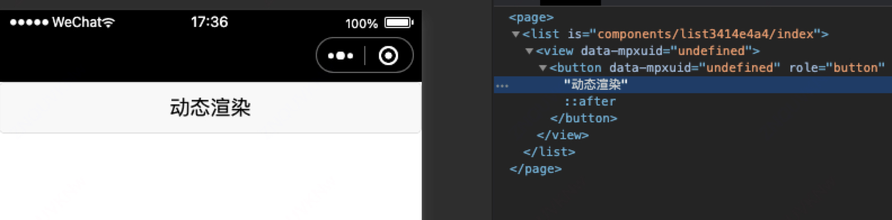

# Template-engine

小程序动态化基础模板生成引擎。

> Fork from @tarojs/shared for generating template.

# Install

```sh
npm install @mpxjs/template-engine
# or
yarn add @mpxjs/template-engine
# or
pnpm add @mpxjs/template-engine
```

# Basic Usage

1. 生成模板代码

```js
const { createTemplateEngine } = require('@mpxjs/template-engine')

const templateEngine = createTemplateEngine('wx') // 'wx' | 'ali' | 'swan' | 'qq' | 'tt' | 'dd' | 'web' | 'tenon'

const templateCode = templateEngine.buildTemplate({
  baseComponents: ['view', 'button'] // 需要使用的小程序基础组件
})
```

将会输出

```html
<template name="mpx_tmpl">
  <element r="{{r}}" wx:if="{{r}}" />
</template>
<template name="t_0_view">
  <view data-mpxuid="{{i.d.uid}}">
    <block wx:for="{{i.c}}" wx:key="index">
      <template is="t_1_container" data="{{i:item}}" />
    </block>
  </view>
</template>
<template name="t_0_button">
  <button data-mpxuid="{{i.d.uid}}">
    <block wx:for="{{i.c}}" wx:key="index">
      <template is="t_1_container" data="{{i:item}}" />
    </block>
  </button>
</template>
<template name="t_0_#text" data="{{i:i}}">
  <block>{{i.ct}}</block>
</template>
<template name="t_0_container">
  <template is="t_0_{{i.nt}}" data="{{i:i}}" />
</template>
<template name="t_1_container">
  <block wx:if="{{i.nt === '#text'}}">
    <template is="t_0_#text" data="{{i:i}}" />
  </block>
  <block wx:else>
    <element r="{{i}}" />
  </block>
</template>
```

2. 写入文件

```js
const fs = require('fs')
fs.writeFile('base.wxml', code)
```

3. 引入基础模板，使用vnode渲染页面

```html
<import src="base.wxml" />
<template is="t_0_container" data="{{ i: r }}" />
```

```js
Component({
  data: {
    r: {
      // 描述节点的vnode
      nt: 'view', // 节点类型
      d: {
        class: "view-class" // 节点属性值
      },
      c: [ // 子节点
        {
          nt: 'button',
          d: {},
          c: [
            {
              nt: '#text',
              ct: '动态渲染'
            }
          ]
        }
      ]
    }
  }
})
```

4. 模板引擎将会在渲染出正确的组件



# Build Options

### 自定义组件/运行时组件

除了基础组件外，模板引擎还支持自定义组件的渲染

```js
const templateCode = templateEngine.buildTemplate({
  normalComponents: [ 'custom-dialog' , 'custom-popup'], // 需要使用的自定义组件
})
```

### 自定义属性名

如果需要自定义某个模板组件的属性，例如生成的组件需要一个`class`属性。可以通过传入对象配置。

```js
const templateCode = templateEngine.buildTemplate({
  baseComponents: [
    {
      view: ['class']
    }
  ] // 需要使用的小程序基础组件
})
```

### 自定义属性值

如果想自定义`class`从`data`的取值。

```js
const templateCode = templateEngine.buildTemplate({
  baseComponents: [
    {
      view: {
        class: 'c'
      }
    }
  ] // 需要使用的小程序基础组件
})
```
